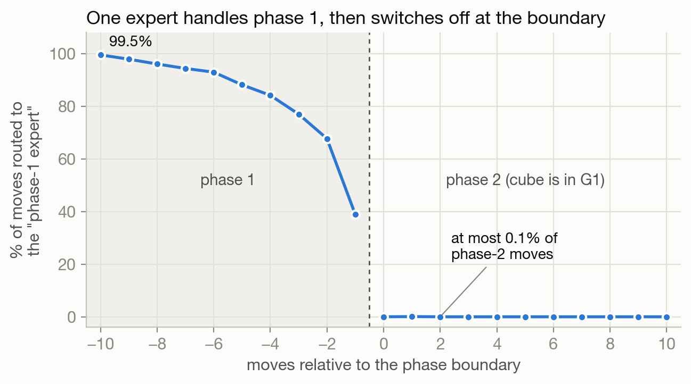
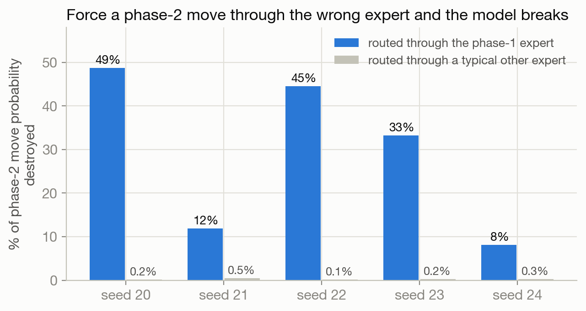
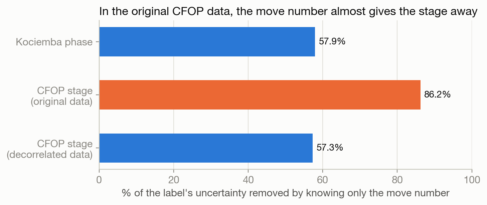
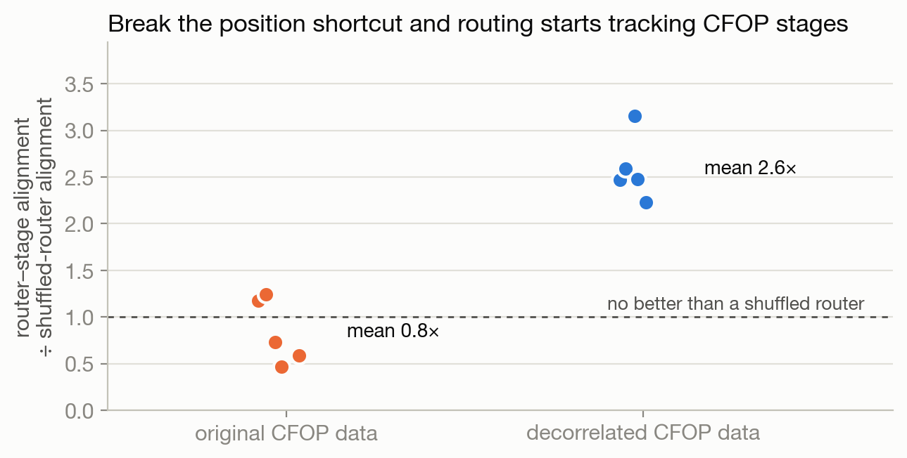
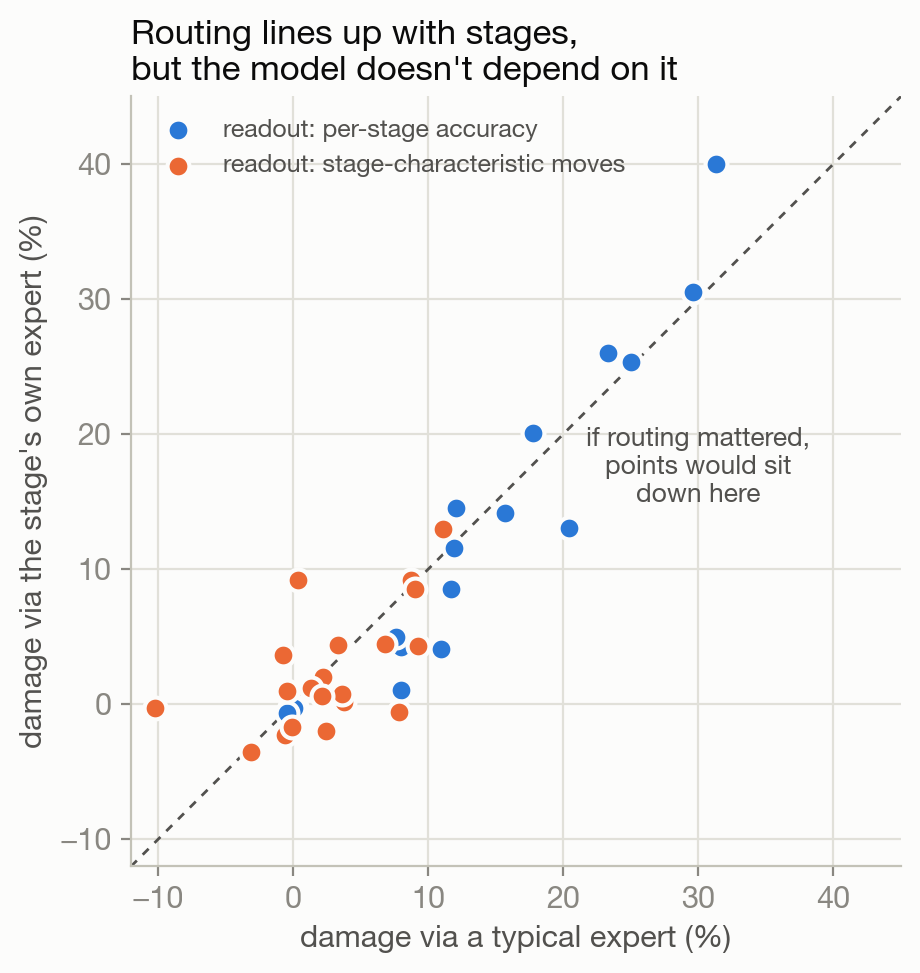

# Does an MoE Router Learn the Algorithm in Its Data?

### It found the two phases of Kociemba's cube algorithm. It didn't find CFOP's four stages, and we can tell you why.

**Ali Tayeb** · Sep 27 2026 · 13 min read

---

Mixture-of-experts models send every token to a few specialized sub-networks, chosen by a small learned router. The obvious question is what those experts specialize in, and the usual way to answer it is to look at which tokens go where and squint. Experts that "handle punctuation," experts that "do math."

The trouble with squinting is that you almost never know what the right answer is. If a router's assignments line up with some concept, you can't easily tell whether the model found real structure or whether you found a pattern you were hoping to see. So we picked a domain where the right answer is known exactly: **Rubik's cube solvers.**

**A router rediscovered the two phases of Kociemba's algorithm without ever being told they exist, and the model depends on that split: route a phase-2 move through the phase-1 expert and it breaks. The same setup did *not* rediscover the four stages of CFOP, a different solving method for the same puzzle. The reason turned out to be mundane: in our CFOP data, the move number already gave the stage away. When we removed that shortcut, the routing started tracking CFOP stages, but we could find no evidence the model actually uses it.**

That last sentence is the part we think matters most, so most of this post is about how we got there.

## Meet the cube

A cube solver is a nice test bed because the structure isn't a vibe; it's a theorem. We used two solving methods with completely different structure.

**Kociemba's two-phase algorithm.** Phase 1 maneuvers the cube into a special subset of positions called G1, the positions you can solve using only the moves `U, D, R2, L2, F2, B2`.[^1] Phase 2 then solves it without ever leaving G1. So the boundary between phases is exact, and it shows up in the moves: once the cube enters G1, quarter turns of R, L, F and B disappear entirely.

**CFOP**, the method most speedcubers use, splits a solve into four stages: build a cross on the bottom (**C**ross), fill the first two layers (**F**2L), **O**rient the last layer, and **P**ermute the last layer. Same puzzle, different decomposition.

We trained small decoder-only transformers where every feed-forward block is a mixture of 8 experts with top-2 routing.[^2] The input is the cube's 54 stickers followed by the moves so far, and the target is the next move. **The model is never given a phase or stage label.** Everything below asks whether the router discovered the labels on its own.

The main Kociemba run is 250,000 solves (5.1 million moves) on a 6-layer model, replicated on a 4-layer model with 25,000 solves. The models learn the task: next-move accuracy is 34%, **2.5×** the best lookup table that already knows both the move number and the phase.[^3]

## The trap: position

Here's the first thing that goes wrong. A cube solve is a sequence, and phase 1 comes before phase 2. So a router that looks only at the move number, ignoring the cube entirely, would already "align" with the phase: early moves go to one expert, late moves to another. Makes sense, right?

It's not hypothetical. Early in the project, a fake router that read *only* the step index scored inside the real router's range on the standard alignment metric. Any result that doesn't control for position is mostly measuring position.

So every alignment number in this post is **conditional on position**: it asks how much the router's choice tells you about the phase *among moves at the same step of the solve*.[^4] And every number is compared against four fake routers that should score zero: a shuffled router, a router that reads only the step index, a *hash* router (a twin model trained with random, fixed expert assignment), and a within-position permutation.[^5]

## Kociemba: the router finds the seam

On Kociemba data, the router's alignment with the phase is **0.258**. The shuffled router scores 0.0013, the hash-router twin 0.014, and the position-only router 0.0000. A separate test asks whether each solve's routing sequence switches at the true boundary rather than at a fixed step. It does, on 5/5 seeds (p = 0.005 each).

The raw routing is easier to read than the metric:

*Figure 1. Share of moves the last layer sends to one particular expert, lined up so that 0 is the first move after the cube enters G1. Seed 20, 1,200 held-out solves. Early in phase 1 that expert gets 99.5% of moves; for the ten moves after the boundary it never gets more than 0.1%.*

That's a clean switch at a boundary the model was never told about. The fade in the last few phase-1 moves is interesting too: as the cube gets close to G1, other experts start taking over before the boundary is actually crossed.

## Breaking it on purpose

Alignment isn't proof, though. A router can sort tokens along some concept while the rest of the network ignores that sorting completely. The question we actually care about is whether the model *uses* it.

So we intervene. Take every phase-2 move and force the router to send it through the expert that handles phase 1. Then measure how much probability the model still puts on legal phase-2 moves (the G1 moves). As a control, force the same moves through each of the *other* experts instead. That control matters: forcing tokens through any single expert disrupts the network a bit, so we want to know whether *which* expert matters, not just whether forcing hurts.

*Figure 2. Share of the model's probability on legal phase-2 moves destroyed by forcing phase-2 moves through the phase-1 expert (blue) versus the median of the other seven experts (gray). 6-layer models, 250k solves, five fresh seeds.*

Sending phase-2 moves through the phase-1 expert destroys **29%** of the model's phase-2 move probability on average (8% to 49% depending on seed). Sending them through a typical other expert destroys **0.26%**. That holds on 5/5 seeds, and on 5/5 seeds of the smaller model too.[^6] Whatever that expert computes is specific to phase 1, and handing it phase-2 work breaks the model.

This was the result we pre-registered: the analysis, the thresholds and the seeds were written down and committed before any of these models were trained.[^7]

## CFOP: nothing

Then the actual test. If routers pick up the decomposition in *their training data*, a model trained on CFOP solutions should route by CFOP stage.

We generated 10,000 CFOP solutions and trained five more models. They learn the task fine (67% accuracy, **3.4×** the matching lookup-table baseline). Then we checked whether each router aligns more with the CFOP stage than with the Kociemba phase, computed on the same cube states.

It didn't, on 0/5 seeds. Stage alignment averaged **0.8×** the shuffled router: no better than random routing. The causal test agreed: forcing a stage's moves through a different expert did no more damage than forcing them through their own.

Worth noting: the CFOP-trained router didn't route on the Kociemba phase either, at least not causally. So this isn't "routers just learn a fixed property of the cube." The router learned neither decomposition.

## Why: the move number gives it away

The obvious explanation is that Kociemba's phases change *which moves are legal* and CFOP's stages don't, so there's nothing for a router to latch onto. We checked, and it's wrong. CFOP stages differ even more sharply in which moves they use than Kociemba's phases do: the orientation and permutation stages use only 7 and 9 of the 18 possible moves.

The real difference is position. Our CFOP solutions have a very regular shape: a short cross, then the F2L inserts, then one algorithm each for OLL and PLL. So the stage is mostly determined by how far into the solve you are.

*Figure 3. Fraction of each label's uncertainty removed by knowing only the move number (1 − H(label | position) / H(label)).*

Knowing only the move number removes **86%** of the uncertainty about the CFOP stage, versus **58%** for the Kociemba phase. In Kociemba, phase 1 can take anywhere from 0 to 11 moves, so the model has to look at the cube to know which phase it's in. In our CFOP data it doesn't. The transformer already knows the position, so the stage comes for free and the router has no reason to encode it.

## Fixing the shortcut

That's a story, and a story fitted to two datasets is cheap. So we tested it directly. Before training anything, we wrote down a fix and the result it had to produce.[^8]

The fix: let the cross stage vary in length from 0 to 25 moves instead of 4 to 8, so the later stages start at unpredictable points. Nothing else about the data changed. That brought the position number down from 86% to **57.3%**, within a point of Kociemba's 57.9% (Figure 3, bottom bar). Same positional shortcut as the dataset where the router succeeded; different decomposition.

*Figure 4. Router–stage alignment divided by the shuffled router's alignment, five seeds per dataset. Below 1 means no better than random routing.*

Routing now tracks CFOP stages: **2.6×** the shuffled router, stage beats phase on 5/5 seeds (p = 0.0075), and each of the four stages gets a different "home" expert in every seed. The same comparison that failed 0/5 now passes 5/5. So the story holds, at least this far: **a router won't encode structure that position already gives away, and it starts encoding it once position stops giving it away.**

## Alignment isn't use

Here's where it stopped working. We ran the same causal test as for Kociemba: force each stage's moves through that stage's own expert versus through a typical expert. If the router's stage sorting mattered, forcing moves through their own expert should do much less damage.

*Figure 5. Each point is one stage in one seed (20 per readout). x: damage from forcing that stage's moves through a typical expert. y: damage from forcing them through the stage's own expert. The two readouts measure different things (drop in accuracy; drop in probability on the moves characteristic of that stage), so compare within a color, not across.*

The points sit on the diagonal. Forcing moves through their own expert did 11.0% damage versus 12.0% for a typical expert (p = 0.27). A plausible objection is that raw accuracy is a blunt readout: forcing *any* expert costs about 12%, so a real difference could get lost. So we built a sharper one, the probability on moves characteristic of each stage, the direct analogue of the G1-move readout that worked for Kociemba. We first checked it on the Kociemba models, where it reproduced the original causal numbers almost exactly (r = 0.9998 across all experts and seeds). On CFOP it found nothing either: 2/5 seeds, p = 0.82, with the point estimate in the wrong direction.

We also hit a trap worth warning others about. Forcing a stage's moves onto an expert that *already* handles most of them does less damage, simply because you're changing fewer tokens' routing. That looks exactly like specialization and has nothing to do with it. It showed up in all three of our causal tests. In the first, it fully explained a fake "specialization" signal (p = 0.008). In the other two, how many of a stage's tokens an expert already handled predicted the damage on its own (p ≈ 0.008 in both, on the stages with the cleanest readout).[^9]

Two honest caveats. Neither causal test had the power to rule out a *small* effect, and the sharper readout improved resolution by 2.9×, just short of the 3× we'd set as the bar for trusting its null.[^10] So the right phrasing is **no evidence the model uses its stage routing**, not evidence that it doesn't.

## Adding it all up

| Test | Result |
|---|---|
| Kociemba: does routing align with the phase? | **Yes.** 0.258 vs 0.0013 shuffled, 5/5 seeds, two model sizes |
| Kociemba: does the model *use* it? | **Yes.** 29% vs 0.26% damage, 5/5 seeds |
| CFOP (original data): does routing align with the stage? | **No.** 0.8× shuffled, 0/5 seeds |
| Is that because position gives the stage away? | 86% of stage uncertainty removed by position, vs 58% for Kociemba |
| CFOP (position shortcut removed): does routing align? | **Yes.** 2.6× shuffled, 5/5 seeds |
| CFOP (position shortcut removed): does the model *use* it? | **No evidence.** Two readouts, p = 0.27 and p = 0.82 |

## Takeaways

**Routers can recover real algorithmic structure, and it can be causal.** The Kociemba result is the cleanest version of "an expert does a specific job" we've seen: one expert does phase-1 work, and handing it phase-2 work breaks the model.

**Routers don't encode what they get for free.** If position already tells the network which stage it's in, the router doesn't bother. That makes "our router doesn't specialize on X" a claim about your data as much as your model. Before reading anything into a routing null, check how much position gives away.

**Alignment is not use.** Our decorrelated CFOP models route by stage 5 times out of 5, and we still can't show they need it. If we'd stopped at the alignment metric, which is where most expert-specialization analyses stop, we'd have reported the opposite conclusion.

**Build the null before the claim.** Nearly every mistake we made came from comparing against the wrong baseline, not from a wrong measurement. The position-only router, the hash-router twin, and the already-routed control each changed an answer at some point in this project.

One more for the MoE crowd: all of this is top-2 routing. When we switched to top-1 with everything else equal, the phase specialization didn't spread across experts; it disappeared, and the causal effect went to zero, while the model still learned the task.

## What we got wrong along the way

Negative results are only credible if you can see how they were checked, so here are the three mistakes that mattered.

- **We tested a control instead of the claim.** Early on we compared the MoE against a dense twin model instead of against the fake routers above. That produced a clean null that survived a four-hour multi-seed study before we noticed it answered the wrong question. Running the right comparison flipped it.
- **A broken control row.** Our first CFOP analysis scored the Kociemba models against the Kociemba phase *twice* under two names, and silently dropped the last two CFOP stages from another table. We caught it because two supposedly different metrics came back bit-identical on all five seeds.
- **An off-by-one.** Our analysis read each move's routing one position too late. It could only hide alignment, never create it. Fixing it made the Kociemba alignment **31% stronger** at the larger scale and changed no conclusions.[^11]

The code, data generators, pre-registration documents (with hashes and timestamps) and every result file are at [github.com/alityb/cubemoe](https://github.com/alityb/cubemoe).

---

### Footnotes

[^1]: G1 = ⟨U, D, R2, L2, F2, B2⟩. The two-phase algorithm is Herbert Kociemba's. Our solver is a from-scratch reimplementation with its own pruning tables, checked against the `kociemba` Python package.

[^2]: Decoder-only transformer, MoE feed-forward blocks with 8 experts and top-2 routing plus a load-balancing loss. Main run: 6 layers, d = 256, 250,000 solves. Replication: 4 layers, d = 128, 25,000 solves. Unless noted, routing numbers are from the last layer only, a choice fixed before looking at results.

[^3]: The target is the solver's exact next move, which is a harsh metric: many moves commute (U then D is the same as D then U), so several different next moves can be equally correct. The 4-layer model reaches 20% (1.4× its baseline).

[^4]: Conditional normalized mutual information between the router's top-1 expert and the label, computed within each step index and averaged with step-count weights.

[^5]: Before any of this we also ran a five-layer data-quality check on every dataset: solutions replay to solved, labels match a recomputation, no duplicated scrambles, no cyclic padding. It caught two data bugs, a mislabelled phase boundary and a repetitive move pattern in the solver's output, each of which would have produced a convincing but wrong result.

[^6]: On the 4-layer, 25k-solve model the effect is smaller, 3.8% vs 1.0%, but present on all five seeds. We don't lead with the ratio of the two bars ("~270×"): when the denominator is a fraction of a percent, the ratio is dominated by noise in the denominator.

[^7]: Six pre-registered programmes in total, each with its hypotheses, thresholds and seeds written down and hashed before the relevant experiment was run. Every verdict in this post uses fresh seeds that were never used for exploration.

[^8]: Pre-registered in a separate amendment, including a condition that would void the experiment: if the new data hadn't landed between 50% and 65% on the Figure 3 measure, we'd have re-specified it rather than analyze it. It landed at 57.3%. One cost we flagged in advance: our CFOP generator builds the three later stages from canonical case algorithms, but the "cross" stage is just the solver undoing the last few random scramble moves. Making it longer makes that stage less like a real cross.

[^9]: The fix is a regression of damage on stage, seed, the fraction of the stage's tokens already routed to that expert, and an "is this the stage's own expert" indicator. Specialization would show up as a negative coefficient on the indicator. It came out at −0.0014 (p = 0.92) for the accuracy readout and +0.005 (p = 0.72) for the move-probability readout.

[^10]: The accuracy readout's background damage (from forcing *any* expert) was about 12%, against a between-expert spread of about 3.7%. The move-probability readout cut the background to 4.4%, a 2.9× gain in resolution. The minimum effect either test could reliably detect was about 2.5–3 points, and the observed effects were 0.9 and 0.2 points.

[^11]: At the 25k scale the fix made no significant difference. The causal numbers never went through the buggy code path and are identical to the last digit.
