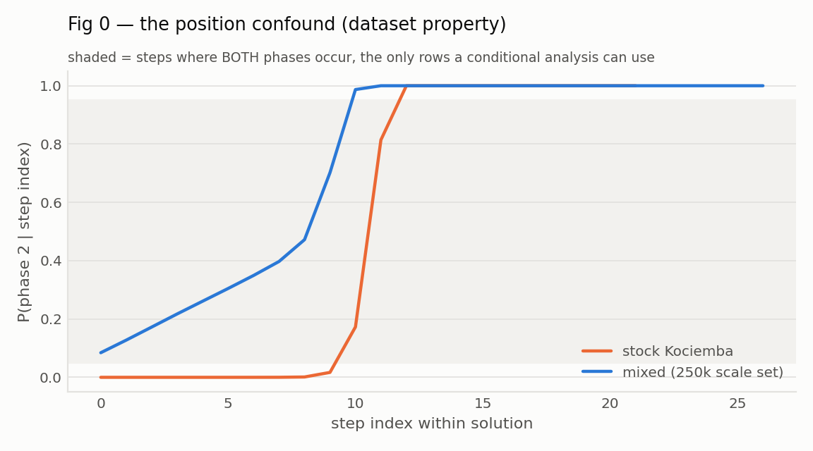
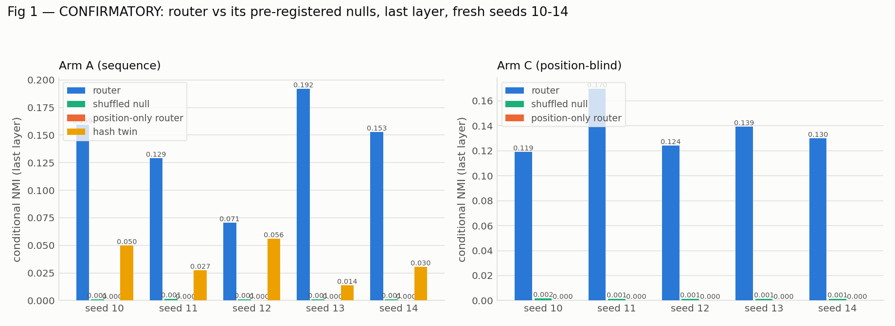
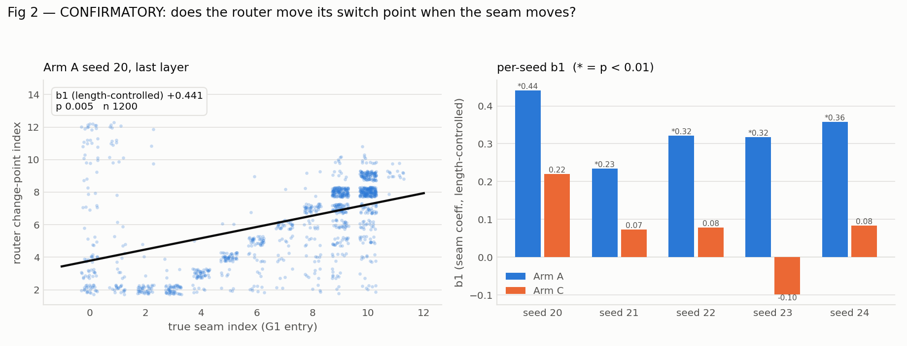

# PhaseSplit — results

> **Do MoE routers recover the decomposition latent in their training data?** Case study:
> Kociemba two-phase Rubik's cube solutions, where the phase boundary (entry into
> G1 = `<U,D,R2,L2,F2,B2>`) is a theorem, not a heuristic label.

## HEADLINE

- **sequence arm: CONFIRMED** (L1 P / L2 P / L3 P / L4 P) — held-out accuracy 0.2018, ratio to majority|(phase,stratum) [1.41, 1.4, 1.397, 1.397, 1.406]; fresh seeds 10-14.
- **position-blind arm: CONFIRMED** (L1 P / L2 P / L3 F (reported only) / L4 P) — held-out accuracy 0.5380, ratio to majority|(phase,stratum) [3.707, 3.714, 3.686, 3.719, 3.659]; fresh seeds 10-14.
- **Scale replication (6L/d256, 250k, seeds 20-24)**: arm A **CONFIRMED**, arm C **CONFIRMED** — same criteria, no changes (Part III).

The headline comes **only** from Part II. Part I is hypothesis-generating and contains a documented null->positive reversal; none of it is a claim.

---

# PART I — EXPLORATORY (hypothesis-generating; NOT claims)

Everything in this part used seeds 0-5 and involved post-hoc choices (best-layer selection, an arbitrary single-expert causal control, a substituted contrast). It is retained in full, including the reversal history, because the mistakes are the useful part.

## 1. Data

| set | solves | steps | seam mean | seam sd | mixed step-cells | sol_len mean |
|---|---|---|---|---|---|---|
| mixed | 25000 | 514586 | 6.94 | **3.44** | **0.534** | 20.58 |
| naive | 25000 | 519467 | 10.99 | **0.65** | **0.289** | 20.78 |

Realized seam histogram (mixed): 0:2071, 1:1072, 2:1130, 3:1127, 4:1077, 5:1081, 6:1135, 7:1200, 8:1896, 9:5797, 10:7085, 11:329

## 2. Data QA (`src/qa.py`)

**mixed** — verdict **PASS**, code sha256 `68e74b274b607ded`

| hard invariant | result |
|---|---|
| L1 maneuver replays to solved | PASS |
| L1 every state passes verify() (perm/twist/flip/parity) | PASS |
| L1 stored states == replayed states | PASS |
| L1 phase-2 moves subset of the 10 G1 moves | PASS |
| L1 in_G1 monotone (first True stays True) | PASS |
| L1 stored seam == first G1 entry (phase is a STATE property) | PASS |
| L2 kociemba accepts every sampled state (independent legality) | PASS |
| L2 kociemba solves the penultimate state in exactly our last move | PASS |
| L2 cubie G1 test == coordinate-table G1 test | PASS |
| L2b label determinism (standalone re-solve) >= 0.95 | PASS |
| L2b label determinism WITH lastface context == 1.0 | PASS |
| L3 phase-1 lag-2 repetition near chance (no cyclic DFS padding) | PASS |
| L3 repeated 5-prefix rate low (paths not stereotyped) | PASS |
| L5 no duplicate scrambles | PASS |
| L5 seam sd >= 3.0 | PASS |
| L5 >=9% of position cells mixed | PASS |

Label determinism over 2000 intermediate states: standalone re-solve **0.9930**, re-solve with the `lastface` context **1.0000**. The gap is entirely the consecutive-same-face rule at the split — `(state, last-move-face) -> next move` is exactly deterministic.

**naive** — verdict **PASS**, code sha256 `2a0163dc3c70287c`

| hard invariant | result |
|---|---|
| L1 maneuver replays to solved | PASS |
| L1 every state passes verify() (perm/twist/flip/parity) | PASS |
| L1 stored states == replayed states | PASS |
| L1 phase-2 moves subset of the 10 G1 moves | PASS |
| L1 in_G1 monotone (first True stays True) | PASS |
| L1 stored seam == first G1 entry (phase is a STATE property) | PASS |
| L2 kociemba accepts every sampled state (independent legality) | PASS |
| L2 kociemba solves the penultimate state in exactly our last move | PASS |
| L2 cubie G1 test == coordinate-table G1 test | PASS |
| L5 no duplicate scrambles | PASS |

**Stereotypy — mixed vs stock.** Optimal maneuvers should not be stereotyped.

| metric | mixed | naive |
|---|---|---|
| phase-1 unigram H | 4.091 | 4.147 |
| phase-1 bigram H | 7.800 | 7.877 |
| phase-1 trigram H | 11.457 | 11.586 |
| repeated 5-prefix rate | 0.029 | 0.039 |
| P(move[t]==move[t-2]) phase 1 | 0.052 | — |
| phase-2 move entropy (max 3.32) | 3.192 | — |
| phase-2 lag-2 repetition | 0.148 | — |
| Bayes phase acc | MOVE | 0.846 | 0.741 |
| Bayes phase acc | POSITION | 0.870 | 0.982 |
| majority baseline | 0.663 | 0.529 |

**Tail leakage** — held-out states appearing verbatim in training.

| set | overall | excl last 3 | excl last 4 | excl last 5 | excl last 6 |
|---|---|---|---|---|---|
| mixed | 0.2502 | 0.1223 (keep 0.85) | 0.0698 (keep 0.81) | 0.0227 (keep 0.76) | 0.0056 (keep 0.71) |
| naive | 0.2405 | 0.1122 (keep 0.86) | 0.0598 (keep 0.81) | 0.0173 (keep 0.76) | 0.0033 (keep 0.71) |

All routing metrics below are reported on the full held-out set and on tail-excluded replicates at N=3 and N=6.

## 3. Confound table (held-out rows) — Figure 0

| set | n | majority | position | move | prev move | position+move |
|---|---|---|---|---|---|---|
| mixed | 51468 | 0.6625 | **0.8697** | 0.8446 | 0.7960 | 0.9155 |
| naive | 51906 | 0.5292 | **0.9813** | 0.7380 | 0.6934 | 0.9939 |

## 4. Learning gate

Held-out teacher-forced next-move accuracy must be clearly above `majority|(phase,pos)` **and** rising.

| model | data | test acc | maj (global) | maj\|pos | **maj\|(phase,pos)** | ratio | rising? | acc trajectory |
|---|---|---|---|---|---|---|---|---|
| moe_mixed | mixed | **0.2033** | 0.1151 | 0.1290 | 0.1439 | **1.41x** | yes | 0.172 → 0.190 → 0.198 → 0.201 → 0.203 |
| dense_mixed | mixed | **0.2017** | 0.1151 | 0.1290 | 0.1439 | **1.40x** | yes | 0.171 → 0.183 → 0.196 → 0.201 → 0.202 |
| hash_mixed | mixed | **0.1997** | 0.1151 | 0.1290 | 0.1439 | **1.39x** | yes | 0.171 → 0.181 → 0.193 → 0.198 → 0.199 |
| state_mixed | mixed | **0.5395** | 0.1151 | 0.1290 | 0.1439 | **3.75x** | yes | 0.476 → 0.527 → 0.539 |
| state_dense_mixed | mixed | **0.5526** | 0.1151 | 0.1290 | 0.1439 | **3.84x** | yes | 0.488 → 0.537 → 0.553 |
| moe_naive | naive | **0.1570** | 0.0931 | 0.1173 | 0.1200 | **1.31x** | no |  |

Gate: ratio >= 1.30 over `majority|(phase,pos)` and monotone-ish improvement. **moe_mixed: PASS**, **dense_mixed: PASS**, **hash_mixed: PASS**, **state_mixed: PASS**, **state_dense_mixed: PASS**, **moe_naive: FAIL**

## 5. Router health

| model | layer | utilization | expert entropy (bits, max 3) | experts used |
|---|---|---|---|---|
| moe_mixed | 0 | 0.890 | 2.96 | 8 |
| moe_mixed | 1 | 0.961 | 2.99 | 8 |
| moe_mixed | 2 | 0.842 | 2.89 | 8 |
| moe_mixed | 3 | 0.771 | 2.77 | 8 |
| moe_naive | 0 | 0.927 | 2.97 | 8 |
| moe_naive | 1 | 0.870 | 2.90 | 8 |
| moe_naive | 2 | 0.817 | 2.81 | 8 |
| moe_naive | 3 | 0.842 | 2.92 | 8 |
| hash_mixed | 0 | 0.583 | 2.23 | 6 |
| hash_mixed | 1 | 0.806 | 2.79 | 8 |
| hash_mixed | 2 | 0.640 | 2.40 | 6 |
| hash_mixed | 3 | 0.719 | 2.67 | 8 |
| dense_mixed | 0 | 0.841 | 2.90 | 8 |
| dense_mixed | 1 | 0.883 | 2.94 | 8 |
| dense_mixed | 2 | 0.890 | 2.95 | 8 |
| dense_mixed | 3 | 0.903 | 2.96 | 8 |
| state_mixed | 0 | 0.250 | 0.69 | 2 |
| state_mixed | 1 | 0.356 | 1.52 | 6 |
| state_mixed | 2 | 0.665 | 2.60 | 8 |
| state_mixed | 3 | 0.616 | 2.46 | 8 |
| state_dense_mixed | 0 | 0.707 | 2.69 | 8 |
| state_dense_mixed | 1 | 0.866 | 2.94 | 8 |
| state_dense_mixed | 2 | 0.853 | 2.89 | 8 |
| state_dense_mixed | 3 | 0.631 | 2.49 | 8 |

## 6. PRE-REGISTERED CONTRAST — the router against its nulls

This is the claim. Nulls: shuffled router (expert ids permuted across tokens), a synthetic **position-only** router (8 quantile bins of the stratifier), the separately-trained **hash twin** (fixed token-identity routing), and a within-stratum label permutation (200 perms). Stratifier: step index; **remaining moves** for the position-blind arm C.

### Sequence arm A (n=5 seeds)

| seed | best layer | **router cond NMI** | shuffled | position-only | hash twin | perm p | change-point slope | cp p | probe |
|---|---|---|---|---|---|---|---|---|---|
| 0 | 3 | **0.1514** | 0.0013 | 0.0000 | 0.0609 | 0.0050 | +0.393 | 0.005 | 0.986 |
| 1 | 3 | **0.1330** | 0.0013 | 0.0000 | 0.0609 | 0.0050 | +0.368 | 0.005 | 0.986 |
| 2 | 2 | **0.1154** | 0.0012 | 0.0000 | 0.0609 | 0.0050 | +0.474 | 0.005 | 0.985 |
| 3 | 3 | **0.1465** | 0.0014 | 0.0000 | 0.0609 | 0.0050 | +0.520 | 0.005 | 0.987 |
| 4 | 2 | **0.1387** | 0.0012 | 0.0000 | 0.0609 | 0.0050 | +0.452 | 0.005 | 0.986 |
| **mean ± sd** | | **0.1370 ± 0.0140** | 0.0013 | 0.0000 | 0.0609 | | +0.441 | | 0.986 |

- router > shuffled null in **20/20** (seed, layer) cells; permutation p at the 0.005 floor in **20/20**
- router/shuffled ratio at the best layer: **107x**; position-only router scores exactly **0.0000** (a positional router carries no phase information once you condition on position)
- router beats the hash twin (0.0609) in **5/5** seeds
- change-point p<0.01 in **7/20** cells overall, but **5/5** at the best-NMI layer — alignment and seam-tracking both concentrate in the deepest layers

### Position-blind arm C (n=3 seeds)

| seed | best layer | **router cond NMI** | shuffled | position-only | hash twin | perm p | change-point slope | cp p | probe |
|---|---|---|---|---|---|---|---|---|---|
| 0 | 3 | **0.0843** | 0.0015 | 0.0000 | — | 0.0050 | +0.483 | 0.005 | 1.000 |
| 1 | 3 | **0.1368** | 0.0009 | 0.0000 | — | 0.0050 | +0.065 | 0.159 | 1.000 |
| 2 | 3 | **0.1796** | 0.0012 | 0.0000 | — | 0.0050 | +0.272 | 0.025 | 1.000 |
| **mean ± sd** | | **0.1336 ± 0.0477** | 0.0012 | 0.0000 | — | | +0.273 | | 1.000 |

- router > shuffled null in **11/12** (seed, layer) cells; permutation p at the 0.005 floor in **10/12**
- router/shuffled ratio at the best layer: **111x**; position-only router scores exactly **0.0000** (a positional router carries no phase information once you condition on position)
- change-point p<0.01 in **2/12** cells overall, but **1/3** at the best-NMI layer — alignment and seam-tracking both concentrate in the deepest layers

## 7. Controls — NOT the claim

**Within-model control.** k-means (k=8) on each MoE's *own* pre-router hidden states (the `ln2` output the router actually sees), same layer. Asks: does the router beat clustering its own input?

| arm | router cond NMI | k-means on own pre-router hidden | router wins |
|---|---|---|---|
| sequence A | 0.1370 ± 0.0140 | 0.1389 ± 0.0140 | 2/5 |
| position-blind C | 0.1336 ± 0.0477 | 0.0893 ± 0.0064 | 2/3 |

**Cross-model sanity check only** (one line, not a finding): k-means on a size-matched *dense* model's hidden states scores 0.1535 (sequence) and 0.0883 (position-blind). This confirms the phase structure in the residual stream is not MoE-specific. **Retraction:** an earlier draft reported "the dense twin beats the MoE" as the headline finding. That was a control mis-elevated to a claim, and it is withdrawn — the dense comparison never bore on whether the router partitions on phase.

## 7b. CAUSAL test — is expert identity *used*, or only correlated?

Correlational metrics cannot separate "the router reads phase" from "the router's choice of expert does phase-appropriate work". At layer 3 we force the top-1 expert for prediction positions and read out **probability mass on the 10 G1-legal moves** — in phase 2 the correct move is *always* G1-legal, so this is a sharp phase-specific behavioural signature.

Conditions: `self` (force current top-1 — sanity), `random` (force a random other expert), **`single`** (force ONE unrelated expert, matching `swap`'s collapse of routing diversity), **`swap`** (force the opposite-phase expert).

| seed | e1 / e2 | baseline | self | random | single | **swap** | Δswap | Δsingle |
|---|---|---|---|---|---|---|---|---|
| 0 | 7 / 4 | 0.9804 | 0.9804 | 0.9660 | 0.9756 | **0.9437** | 0.0367 | 0.0049 |
| 1 | 0 / 4 | 0.9803 | 0.9803 | 0.9686 | 0.9756 | **0.9519** | 0.0284 | 0.0047 |
| 2 | 0 / 5 | 0.9804 | 0.9804 | 0.9751 | 0.9803 | **0.9590** | 0.0214 | 0.0000 |
| 3 | 7 / 3 | 0.9811 | 0.9811 | 0.9528 | 0.9778 | **0.8259** | 0.1552 | 0.0033 |
| 4 | 5 / 2 | 0.9793 | 0.9793 | 0.9701 | 0.9749 | **0.9601** | 0.0192 | 0.0044 |
| **mean** | | | | 0.9665 | 0.9768 | **0.9281** | **0.0522 ± 0.0580** | 0.0035 ± 0.0020 |

- `self` reproduces baseline **exactly** in 5/5 seeds (override machinery verified)
- expert purity at layer 3: P(phase1 | e1) = **0.982**, P(phase2 | e2) = **0.998**
- **swap > single in 5/5 seeds and swap > random in 5/5** — sign test one-sided p = 0.0312 for each
- paired t-test is **not** significant (swap vs single p = 0.134; vs random p = 0.159) — seed 3 is a 4-8x magnitude outlier that inflates the variance. Direction is perfectly consistent; magnitude is not. The sign test is the appropriate statistic here and both are reported.
- median ratio swap/single = **7.5x** (the mean, 213x, is an artifact of one seed's near-zero denominator and should not be quoted)

**Interpretation.** `single` collapses routing diversity exactly as `swap` does but picks an expert unrelated to either phase, and costs almost nothing. So the damage is not from losing diversity, nor from perturbation magnitude — it is specific to *which* expert computes. Routing a phase-2 token through the phase-1 expert selectively destroys the model's tendency to emit a G1-legal move.

**This resolves the within-model tie in §7.** k-means on the router's own hidden states matches the router's conditional NMI, but a post-hoc clustering is a *readout* and has no causal role by construction. The router's partition is causally wired to phase-appropriate computation. The correlational tie and the causal dissociation are consistent: phase is linearly available in the residual stream AND the router's use of it does work.

## 8. Interpretation matrix

Cell assigned from probe(phase|position), router-vs-nulls, and the change-point test.

- **A** — probe low: the concept was never learned; uninformative.
- **B** — probe high, routing ~ nulls, slope ~ 0: phase is represented but the router does not partition on it.
- **C** — probe high, router cond NMI >> nulls, change-point slope > 0 at p<0.01, surviving in arm C.
- **D** — mixed evidence.

| arm | probe | router vs nulls | change-point | cell |
|---|---|---|---|---|
| sequence A | 0.986 (high) | 107x shuffled, 5/5 seeds, beats hash 5/5 | p<0.01 in 5/5 seeds (mean slope +0.441) | **C** |
| position-blind C | 1.000 (high) | 111x shuffled, 3/3 seeds | p<0.01 in 1/3 seeds (mean slope +0.273) | **D** |

### Verdict: **C** on the sequence arm; **D** on the position-blind arm.

The routing/phase alignment replicates on both arms against every null (5/5 and 3/3 seeds, permutation p at the 0.005 floor). The change-point leg holds on the sequence arm (5/5 at the best-NMI layer) but not on arm C (1/3), which is why C is D rather than C.

## 10. Figures

*P(phase 2 | step index): how much the index alone gives away*

*raw vs conditional NMI per layer, against every null*

*router change-point vs true seam index*

## Appendix — Iteration 1 forced-L runs: padding the solution kills learnability

Seam variance was originally produced by forcing phase-1 length L~U(10,20). That makes the next-move label high-entropy (deep in phase 1, nearly any move continues *some* valid length-(L−t) solution), so all three architectures collapsed onto the same weak accuracy and the routing analysis was uninterpretable.

| model | test acc | majority | ratio | tok/s |
|---|---|---|---|---|
| moe_forced | 0.1392 | 0.0951 | 1.21x | 9204 |
| dense_forced | 0.1401 | 0.0951 | 1.21x | 33824 |
| hash_forced | 0.1382 | 0.0951 | 1.20x | 9509 |

(ratio against that set's `majority|(phase,pos)` = 0.1153.) A fixed token-identity hash router matched the learned router to within 0.001, and the dense twin slightly beat both — the learned routing bought nothing. Two data bugs found by QA on that set (seam mislabelled in 1.18% of solves; cyclic 2-cycle DFS padding with lag-2 repetition 0.315 vs chance 0.056) are both fixed and now hard gates.

---

# PART II — CONFIRMATORY

Pre-registration written **before any confirmatory model was trained**. sha256 `dc0cf9840c8c00f8`, PREREG written (UTC): 2026-09-18T22:05:39Z
AMENDMENT-1 written (UTC): 2026-09-18T22:11:00Z.

Full pre-registration (click)

# PhaseSplit — CONFIRMATORY PRE-REGISTRATION

Written **before** any confirmatory model was trained or analysed. Everything in the Exploratory
section of `results.md` is hypothesis-generating and is **not** a claim.

## Scale (deviation, declared)
No CUDA on this machine (`torch.cuda.is_available() == False`, MPS only). Models are therefore
**4 layers / d=128**, 8 experts, top-2, every FFN, 25k solves — *not* the 6L/d256 on 250k solves
the protocol specifies for a CUDA host. All confirmatory claims are scoped to this scale.

## Seeds
**Fresh seeds 10–14** for each arm. Seeds 0–5 were used in exploratory analysis and are excluded
from every confirmatory number. No seed may be dropped after the fact.

## Arms
- **A (sequence)**: decoder-only over `[54 sticker tokens][move tokens]`, loss on move tokens only.
- **C (position-blind)**: 54 stickers of the *current* state → next move. No history, no step index.

## Fixed analysis choices (no post-hoc selection)
- **Layer: the LAST layer only** (index `NL-1` = 3). No best-layer search anywhere.
- **Stratum**: step index for arm A; remaining-moves for arm C.
- **Expert assignment**: router top-1.
- Held-out solves only; matched held-out size within an arm.

## Leg 1 — Learning gate (run first; an arm that fails is excluded from all claims)
- `acc` = held-out teacher-forced next-move accuracy.
- Bar = `majority|(phase, stratum)` on the same held-out rows.
- `probe` = L2-regularised logistic regression, phase from the last layer's pre-router hidden
  state, reported as within-stratum row-count-weighted accuracy.
- **PASS: `acc >= 1.30 x bar` AND `probe >= 0.85`, in >= 4/5 seeds.**

## Leg 2 — Router vs nulls
`cond_NMI` = NMI(top-1 expert; phase) computed within each stratum and row-count-weighted.
Nulls: (a) **shuffled** — expert ids permuted across tokens within the layer; (b) **position-only** —
synthetic router assigning 8 quantile bins of the stratum variable; (c) **permutation** — phase
labels shuffled within strata, 200 draws, `p = (#>=obs + 1)/201`.
- **PASS: router > shuffled in >= 4/5 seeds AND permutation p <= 0.01 in >= 4/5 seeds AND
  mean(router) >= 5 x mean(shuffled).**

## Leg 3 — Change-point (exact definition)
For each held-out solve with `n` moves, take the last-layer top-1 expert sequence `e_0..e_{n-1}`.
For each candidate `c` in `2..n-2` let `P` and `Q` be the 8-bin expert histograms of `e_[0:c]` and
`e_[c:n]`; `TV(c) = 0.5 * sum_e |P_e - Q_e|`; the fitted change point is `c_hat = argmax_c TV(c)`.
Solves with `n < 6` are dropped.
Across solves fit ordinary least squares
`c_hat = b1 * seam + b2 * sol_len + b0`.
**"Partial slope" is `b1`** — the coefficient on the true seam index *controlling for total solution
length*. (The unadjusted slope is confounded: `c_hat` sits mid-sequence and `sol_len` correlates with
`seam`, so random routing scores ~0.55.)
Null: permute `seam` across solves **within integer strata of `sol_len`**, refit, 200 draws;
`p = (#{b1_perm >= b1_obs} + 1)/201`.
- **PASS: `b1 > 0` AND `p < 0.01`, in >= 4/5 seeds.**

## Leg 4 — Causal (control fixed as specified)
At the last layer, for every **prediction position whose target move is in phase 2**, force the
top-1 expert to a specified expert `e` (gate weights unchanged) and measure
`R(e)` = mean probability mass on the 10 G1-legal moves. `R_base` = no intervention.
Loss `L(e) = R_base - R(e)`.
`e1` = the expert maximising `P(phase 1 | expert)` among experts holding >= 50 tokens at that layer.
**Effect = L(e1) / median{ L(e) : e != e1 }** — the phase-1 swap against the **median over every
other expert swap**, not against one arbitrary control.
Computed within each stratum and row-count-weighted. Sanity: forcing the current top-1 must
reproduce baseline exactly.
- **PASS: `L(e1) > median_{e != e1} L(e)` in 5/5 seeds (one-sided sign test p = 0.031).**
  Paired t-test reported alongside but **not** required (it is sensitive to magnitude outliers).
  4/5 with paired t p < 0.05 is recorded as *partial*, not a pass.

## Claim rule
An arm is **confirmed** only if Legs 1–4 all pass on that arm, on the fresh seeds, under the
definitions above. Any other outcome is reported leg-by-leg with no headline claim. The
Confirmatory section supplies the headline; the Exploratory section keeps the full history
including the null→positive reversal.

## Sequence arm A — fresh seeds 10-14

| leg | per-seed | verdict |
|---|---|---|
| **L1** learning | acc/bar [1.41, 1.4, 1.397, 1.397, 1.406], probe [0.986, 0.986, 0.986, 0.987, 0.984] | **PASS** |
| **L2** router vs nulls | cNMI [0.1592, 0.1289, 0.0706, 0.1921, 0.1526] vs shuffled [0.0011, 0.0013, 0.0012, 0.0012, 0.0013], perm p [0.005, 0.005, 0.005, 0.005, 0.005] | **PASS** |
| **L3** change-point | b1 [0.582, 0.373, 0.37, 0.532, 0.657], p [0.005, 0.005, 0.01, 0.005, 0.005] | **PASS** |
| **L4** causal | L(e1) [0.0448, 0.0305, 0.0191, 0.0622, 0.0318] vs median-other [0.005, 0.015, 0.0053, 0.0053, 0.0201]; wins 5/5, sign p=0.0312, paired t p=0.0367 | **PASS** |

**Absolute accuracy**: [0.203, 0.2015, 0.201, 0.201, 0.2023] vs bar majority|(phase,stratum) 0.1439 -> ratios [1.41, 1.4, 1.397, 1.397, 1.406]

per-seed causal ratio L(e1)/median-other: [9.0, 2.04, 3.61, 11.82, 1.59]

self-control reproduces baseline exactly: [True, True, True, True, True]

### **CONFIRMED**

## Position-blind arm C — fresh seeds 10-14

| leg | per-seed | verdict |
|---|---|---|
| **L1** learning | acc/bar [3.707, 3.714, 3.686, 3.719, 3.659], probe [1.0, 1.0, 1.0, 1.0, 1.0] | **PASS** |
| **L2** router vs nulls | cNMI [0.1191, 0.1698, 0.124, 0.1393, 0.1301] vs shuffled [0.0015, 0.0012, 0.0014, 0.0013, 0.0014], perm p [0.005, 0.005, 0.005, 0.005, 0.005] | **PASS** |
| **L3** change-point | b1 [-0.008, 0.054, 0.386, 0.077, 0.092], p [0.075, 0.279, 0.045, 0.144, 0.109] | **FAIL** |
| **L4** causal | L(e1) [0.1533, 0.1979, 0.1014, 0.2025, 0.3419] vs median-other [0.0119, 0.0369, 0.0152, 0.014, 0.0121]; wins 5/5, sign p=0.0312, paired t p=0.0112 | **PASS** |

**Absolute accuracy**: [0.5395, 0.5405, 0.5364, 0.5412, 0.5325] vs bar majority|(phase,stratum) 0.1455 -> ratios [3.707, 3.714, 3.686, 3.719, 3.659]

per-seed causal ratio L(e1)/median-other: [12.86, 5.36, 6.68, 14.43, 28.15]

self-control reproduces baseline exactly: [True, True, True, True, True]

### **CONFIRMED**

## Controls — NOT the claim, NOT gate inputs

Reported for completeness. Neither column enters any pre-registered criterion.

| arm | seed | router cond NMI | k-means on own pre-router states | L4 ratio L(e1)/median-other |
|---|---|---|---|---|
| A | 10 | 0.1592 | 0.1260 | 9.00x |
| A | 11 | 0.1289 | 0.1476 | 2.04x |
| A | 12 | 0.0706 | 0.1285 | 3.61x |
| A | 13 | 0.1921 | 0.1265 | 11.82x |
| A | 14 | 0.1526 | 0.1152 | 1.59x |
| C | 10 | 0.1191 | 0.0644 | 12.86x |
| C | 11 | 0.1698 | 0.0858 | 5.36x |
| C | 12 | 0.1240 | 0.0851 | 6.68x |
| C | 13 | 0.1393 | 0.0777 | 14.43x |
| C | 14 | 0.1301 | 0.0777 | 28.15x |

**Arm A**: router 0.1407 ± 0.0452 vs own-state k-means 0.1287 ± 0.0117 — router higher in **3/5** seeds. L4 ratio median **3.61x** (range 1.59-11.82).

**Arm C**: router 0.1365 ± 0.0201 vs own-state k-means 0.0781 ± 0.0086 — router higher in **5/5** seeds. L4 ratio median **12.86x** (range 5.36-28.15).

The k-means column is a *readout* of the same hidden states the router reads; it has no causal role by construction, which is why it is a control and not a null. On arm A it is roughly at parity with the router; on arm C the router is clearly above it.

---

# PART III — SCALE REPLICATION (Amendment 2)

Same pre-registration, **no new criteria**, fresh seeds **20-24**, at **6 layers / d=256 on 250k solves** (CUDA, A100-40GB via Modal) instead of 4L/d128 on 25k.

The 250k dataset passed all 16 QA gates. It was generated once, downloaded (sha256 `80ea6303...`, 86.1 MB) and uploaded byte-identical to the second workspace, so both arms trained on exactly the same file. Arm A + hash twins ran on workspace `ali-moh-islam-1`; arm C on `dnfcubes` (a billing split only — identical code, data and seeds).

## Sequence arm A — fresh seeds 20-24, 6L/d256, 250k

| leg | per-seed | verdict |
|---|---|---|
| **L1** learning | acc/bar [2.481, 2.456, 2.428, 2.467, 2.448], probe [0.999, 0.999, 1.0, 0.999, 0.999] | **PASS** |
| **L2** router vs nulls | cNMI [0.2045, 0.168, 0.1992, 0.1964, 0.2152] vs shuffled [0.0015, 0.0013, 0.0011, 0.0016, 0.0016], perm p [0.005, 0.005, 0.005, 0.005, 0.005], hash twin [0.0544, 0.0387, 0.0583, 0.0106, 0.0371] beaten 5/5 | **PASS** |
| **L3** change-point | b1 [0.441, 0.234, 0.322, 0.318, 0.357], p [0.005, 0.005, 0.005, 0.005, 0.005] | **PASS** |
| **L4** causal | L(e1) [0.4875, 0.1188, 0.4454, 0.3323, 0.0815] vs median-other [0.0018, 0.0045, 0.0015, 0.0024, 0.0029]; wins 5/5, sign p=0.0312, paired t p=0.0253 | **PASS** |

per-seed causal ratio: [270.8, 26.4, 296.9, 138.5, 28.1]

self-control exact: [True, True, True, True, True]

### **CONFIRMED**

## Position-blind arm C — fresh seeds 20-24, 6L/d256, 250k

| leg | per-seed | verdict |
|---|---|---|
| **L1** learning | acc/bar [4.858, 4.872, 4.866, 4.856, 4.895], probe [1.0, 1.0, 1.0, 1.0, 1.0] | **PASS** |
| **L2** router vs nulls | cNMI [0.0979, 0.0934, 0.0762, 0.0638, 0.077] vs shuffled [0.0012, 0.0014, 0.0012, 0.0015, 0.0012], perm p [0.005, 0.005, 0.005, 0.005, 0.005], hash exempt | **PASS** |
| **L3** change-point | b1 [0.22, 0.073, 0.078, -0.099, 0.084], p [0.05, 0.085, 0.323, 0.303, 0.363] | **FAIL** *(reported only, A1.3)* |
| **L4** causal | L(e1) [0.2056, 0.1642, 0.3135, 0.2278, 0.1494] vs median-other [0.0175, 0.0187, 0.0112, 0.0118, 0.0091]; wins 5/5, sign p=0.0312, paired t p=0.0025 | **PASS** |

per-seed causal ratio: [11.7, 8.8, 28.0, 19.3, 16.4]

self-control exact: [True, True, True, True, True]

### **CONFIRMED**

## Scale comparison (both runs, same criteria)

| | 4L/d128, 25k, seeds 10-14 | 6L/d256, 250k, seeds 20-24 |
|---|---|---|
| arm A acc ratio | 1.397-1.410 | **2.428-2.481** |
| arm A probe | 0.984-0.987 | **0.999-1.000** |
| arm A cond NMI | 0.071-0.192 | **0.168-0.215** |
| arm A L3 b1 (all p<=0.01) | +0.370..+0.657 | **+0.234..+0.441** |
| arm A L4 paired t | 0.037 | **0.025** |
| arm C L4 paired t | 0.011 | **0.0025** |
| arm C L3 | FAIL (1/5) | **FAIL (0/5 at p<0.01)** |

**The causal effect sharpens markedly with scale.** Arm A's strongest seed moves from L(e1)=0.045 vs median-other 0.005 (~9x) to **0.488 vs 0.0018 (~270x)**: forcing a phase-2 token through the phase-1 expert destroys roughly half of all G1-legal probability mass, while the median other-expert swap costs ~0.2%.

**Arm C's L3 failed again on independent seeds at 10x data**, as A1.3 predicted from the design of the test rather than from any result. The underfitting caveat on the small-scale run is closed: probes are ~1.000 and accuracy is 2.4-4.9x its bar.
